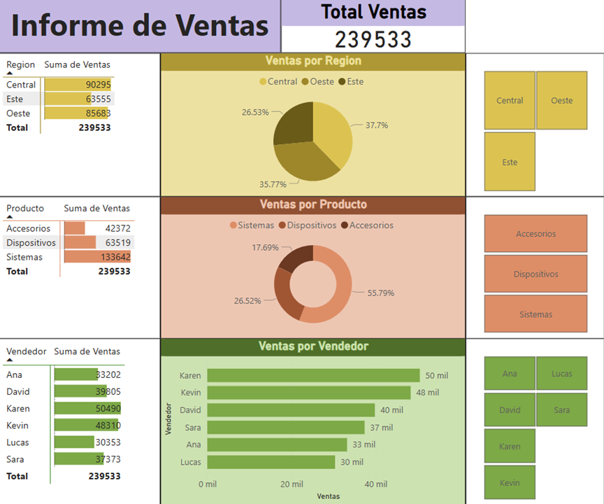

# Dashboard de Power BI: Reportes por Región, Producto y Vendedor  

Este dashboard presenta un análisis detallado de las ventas segmentadas por región, producto y vendedor, proporcionando información clave para la toma de decisiones estratégicas.  

  

 
- [Reporte Final (PDF)](Reporte_Region-Producto-Vendedor.pdf)  
- [Fuente de Datos (Excel)](Ventas.csv)  

Explora los datos y obtén insights valiosos para optimizar el rendimiento comercial.  

---
- [Documento Guía (PDF)](guia-semana-01-02.pdf) 

